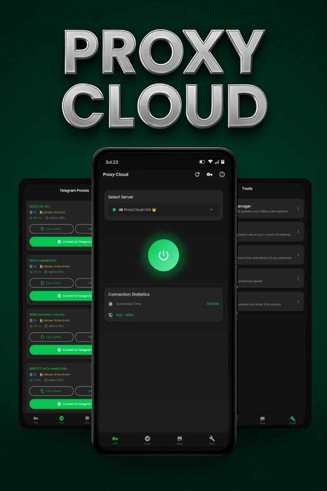

# Proxy Cloud

<p align="center">
  
</p>

<p align="center">
  
</p>

<p align="center">
  <b>A modern, feature-rich VPN client that's fast, unlimited, secure, and completely free.</b>
</p>

<p align="center">
  <a href="FA.md">فارسی</a> | <a href="ZH.md">中文</a> | <a href="RU.md">Русский</a>
</p>

## 🚀 Overview

Proxy Cloud is a powerful Flutter application designed to provide secure, private internet access through V2Ray VPN technology and Telegram MTProto proxies. With an intuitive dark-themed interface and comprehensive features, Proxy Cloud puts you in control of your online privacy without any subscription fees or hidden costs.

## ✨ Key Features

### 🔒 V2Ray VPN
- **One-Tap Connection**: Connect to V2Ray servers instantly with a single tap
- **Subscription Management**: Import, organize, and update configurations via subscription URLs
- **Real-Time Monitoring**: Track connection status and performance metrics
- **Server Selection**: Browse and select from multiple server locations
- **Custom VPN Settings**: Configure bypass subnets and DNS options for advanced users

### 💬 Telegram Proxies
- **Extensive Proxy Collection**: Browse and connect to MTProto proxies from around the world
- **Detailed Information**: View country, provider, ping, and uptime statistics for each proxy
- **Seamless Integration**: One-tap connection to Telegram via selected proxies
- **Easy Sharing**: Copy proxy details to clipboard for sharing with others

### 🛠️ Advanced Tools
- **IP Information**: View detailed information about your current IP address and location
- **Host Checker**: Test status, response time, and details of any web host
- **Speed Test**: Measure your internet connection download and upload speeds
- **Subscription Store**: Discover and add new V2Ray configurations from a curated collection
- **Subscription Manager**: Add, edit, delete, and update your V2Ray subscriptions in one place

### 🎨 Modern UI/UX
- **Sleek Dark Theme**: Elegant dark interface with green accents for comfortable viewing
- **Intuitive Navigation**: Bottom navigation bar for easy access to all features
- **Smooth Animations**: Polished transitions and visual effects throughout the app
- **Real-Time Indicators**: Visual feedback on connection status (connected, connecting, disconnected)
- **Responsive Design**: Optimized for various screen sizes and orientations

## 📱 Installation

### Download

| Architecture | Download Link |
|-------------|---------------|
| Universal   | <a href="https://github.com/code3-dev/ProxyCloud/releases/latest/download/proxycloud-universal.apk"></a> |
| armeabi-v7a | <a href="https://github.com/code3-dev/ProxyCloud/releases/latest/download/proxycloud-armeabi-v7a.apk"></a> |
| arm64-v8a   | <a href="https://github.com/code3-dev/ProxyCloud/releases/latest/download/proxycloud-arm64-v8a.apk"></a> |
| x86_64      | <a href="https://github.com/code3-dev/ProxyCloud/releases/latest/download/proxycloud-x86_64.apk"></a> |

#### Windows
- [📦 Windows Installer (.exe)](https://github.com/code3-dev/ProxyCloud-GUI/releases/latest/download/proxycloud-gui-win-x64.exe)
- [💼 Windows Portable (.exe)](https://github.com/code3-dev/ProxyCloud-GUI/releases/latest/download/proxycloud-gui-win-portable.exe)

#### macOS
- [🍎 macOS Intel (x64) (.dmg)](https://github.com/code3-dev/ProxyCloud-GUI/releases/latest/download/proxycloud-gui-mac-x64.dmg)
- [🍎 macOS Apple Silicon (arm64) (.dmg)](https://github.com/code3-dev/ProxyCloud-GUI/releases/latest/download/proxycloud-gui-mac-arm64.dmg)
- [📦 macOS Intel (x64) (.zip)](https://github.com/code3-dev/ProxyCloud-GUI/releases/latest/download/proxycloud-gui-mac-x64.zip)
- [📦 macOS Apple Silicon (arm64) (.zip)](https://github.com/code3-dev/ProxyCloud-GUI/releases/latest/download/proxycloud-gui-mac-arm64.zip)

#### Linux
- [🐧 Linux (.deb)](https://github.com/code3-dev/ProxyCloud-GUI/releases/latest/download/proxycloud-gui-linux-amd64.deb)
- [🐧 Linux (.rpm)](https://github.com/code3-dev/ProxyCloud-GUI/releases/latest/download/proxycloud-gui-linux-x86_64.rpm)
- [🐧 Linux (.AppImage)](https://github.com/code3-dev/ProxyCloud-GUI/releases/latest/download/proxycloud-gui-linux-x86_64.AppImage)
- [🐧 Linux (.tar.gz)](https://github.com/code3-dev/ProxyCloud-GUI/releases/latest/download/proxycloud-gui-linux-x64.tar.gz)

#### Arch Linux

ProxyCloud is now on the [AUR](https://aur.archlinux.org/packages/proxycloud-gui-bin), therefore you can install it using your prefered AUR helper.

```bash
paru -S proxycloud-gui-bin

# or if you are using yay

yay -S proxycloud-gui-bin
```

### For Developers

#### Prerequisites
- Flutter SDK
- Dart SDK
- Android Studio / VS Code
- Android device or emulator

### Build Steps

1. Clone the repository:
   ```bash
   git clone https://github.com/code3-dev/ProxyCloud.git
   cd ProxyCloud
   ```

2. Install dependencies:
   ```bash
   flutter pub get
   ```

3. Run the app in debug mode:
   ```bash
   flutter run
   ```

4. Build release APK:
   ```bash
   flutter build apk
   ```

## 📖 Usage Guide

### Setting up V2Ray
1. Navigate to the VPN tab (home screen)
2. Tap on "Add Subscription" to enter your subscription URL and name
3. Wait for the servers to load from your subscription
4. Select a server from the list
5. Tap the large connect button to establish a VPN connection

### Managing Subscriptions
1. Go to the Tools tab
2. Select "Subscription Manager"
3. Here you can add new subscriptions, edit existing ones, or delete unwanted subscriptions
4. Use the refresh button to update all subscriptions at once

### Using Telegram Proxies
1. Navigate to the Proxy tab
2. Browse the list of available MTProto proxies
3. Tap "Connect" on a proxy to open Telegram with the selected proxy configuration
4. Alternatively, tap the copy icon to copy the proxy details to manually configure in Telegram

### Exploring the Store
1. Go to the Store tab
2. Browse the curated list of V2Ray subscription providers
3. Tap on any item to view details
4. Use the "Add" button to quickly add a subscription to your collection

### Using Tools
1. Navigate to the Tools tab
2. Select from various utilities:
   - IP Information: Check your current IP address and location details
   - Host Checker: Test connectivity to any website or server
   - Speed Test: Measure your connection speed
   - VPN Settings: Configure advanced options for the VPN connection

## 🤝 Contributing

We welcome contributions to make Proxy Cloud even better! Here's how you can help:

1. Fork the repository
2. Create your feature branch: `git checkout -b feature/amazing-feature`
3. Commit your changes: `git commit -m 'Add some amazing feature'`
4. Push to the branch: `git push origin feature/amazing-feature`
5. Open a Pull Request

Please read [CONTRIBUTING.md](CONTRIBUTING.md) for details on our code of conduct and the process for submitting pull requests.

## 📄 License

This project is licensed under the MIT License - see the [LICENSE](LICENSE) file for details.

## 📜 Legal

- [Privacy Policy](PRIVACY.md) - How we handle your data and protect your privacy
- [Terms of Service](TERMS.md) - Rules and guidelines for using Proxy Cloud

## Star History

[](https://www.star-history.com/#code3-dev/ProxyCloud&Date)

## 📞 Support

If you encounter any issues or have questions, please open an issue on our GitHub repository.

## 🙏 Acknowledgements

- [Flutter](https://flutter.dev/) - UI toolkit for building natively compiled applications
- [V2Ray](https://www.v2ray.com/) - A platform for building proxies to bypass network restrictions
- [Provider](https://pub.dev/packages/provider) - State management solution
- All contributors who have helped shape this project

---

<p align="center">
  <b>Developed by Hossein Pira</b><br>
  <i>Fast, Unlimited, Safe and Free</i>
</p>
